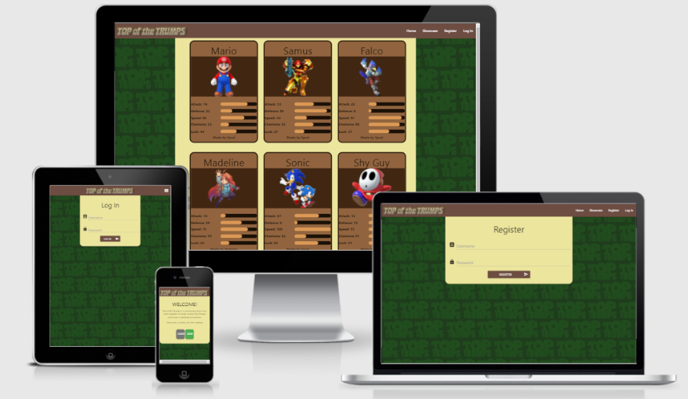
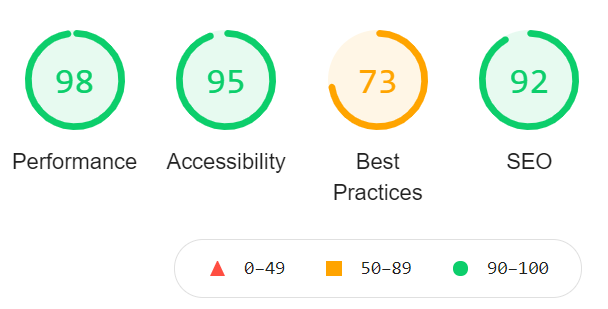

# Top of the Trumps
## An Backend Development Project by Edward Stanley
'Top of the Trumps' is a database driven project using MongoDB for data storage and retrieval as well as Materialize for the styling and form elements. The website allows users to create their own cards based on the popular card game Top Trumps, the goal being the crossover of multiple characters and fandoms to create one large Top Trumps card depository.
Users have the ability to create their own private accounts in which they can create, edit and delete their creations whilst leaving the work of others untouched. 
#

## UX
## Different User objectives
### Site Owner's objectives
* The owner wants to create a community for creating Top Trumps cards
* The owner wants to create a pleasant website experience for the user

### Registered User objectives
* The user wants to be able to create a card modelled after the game 'Top Trumps'
* The user wants to be able to make changes to a card if necessary
* The user wants to be able to delete a card if necessary
* The user wants their creations to be safe from other people editing/deleting them
* The user wants to be able to see other creations in the community
* The user wants to be able to log in and out securely
* The user wants any data relating to IP ect to be kept private
* The user wants visual aids for the card statistics

### Unregistered User objectives
* The user wants to be able to create an account with a secure username/password
* The user might want to see community creations before registering

## User Stories
### As an owner:
* I want the site to have navigation controls for multiple devices
* I want the user to have as much control over their account as possible
* I want to create a site which credits community members who make content for it

### As a user:
* I want to be able to create my own cards including stats, graphics, and names
* I want to be able to create a unique account, and have full control over what content is in there
* I want to see what cards the community has created, and who created them
* I want a secure registration, log in, log out process using password encryption

#
## Wireframes
The following wirefrane was made in Balsamiq  
[Please Click Here.](readmeassets/wireframe_ms3.pdf)

The wireframe can also be found in the readmeassets folder included in this project

#
## Features
### Existing Features
For the features I will go on a page to page basis.

### The Landing Page (index.html)
1) Has informative text letting the user know what the website is about
2) Has working buttons for registering and loging in, depending on the user's needs

### The Showcase Page (showcase.html)
1) Displays all the cards created by the community, each card displays the name of the card, the associated image, the statistics of the card based on 5 key values with accompanying bars for visual aid, and the username of the maker of the card

### The Login/Register Page (login.html/register.html)
1) Contains text fields for the user to input a username and password
2) If an error occurs such as a repeated username or wrong password a flash message is displayed notifying the user
3) A button which sends data to the database once conditions are fufilled which can write a new entry to the database, or check if the user's credentials are correct

### The Card Creation/Editing Page (card_maker.html/edit_card.html)
1) Contains multiple form inputs for the values of a card. The details are a text input for the name, a url input for the picture, sliders to adjust the stat values, and a button to write to the database or submit changes.
2) If editing, the current values of the card are automatically updated into the form.
3) Form validation notifies the user if something is wrong

### The Profile Page (profile.html)
1) Only displays the cards the user themselves have made
2) Adds buttons to the cards allowing for editing and deletion
3) Uses cookies to recognise which user is using the website and fetches their data accordingly

### The Base Page (base.html)
1) The template page which loads content from other pages into itself to display
2) A dropdown navbar full of links for accessing the website which updates its displayed values based on whether the user is logged in or not
3) A secondary navbar for smaller screens holding all the links allowing for small screen navigation
4) Contains the logo and main background for all pages

### Features Left to Implement
1) A way for the user to export their completed card as a png file
2) A way for users to 'subscribe' to other user's cards allowing them to add them into a custom deck in their profile
3) A game using those custom decks allowing users to play top trumps in browser

#
## Technologies Used
- HTML5 - Allows the website to be structured
- CSS - Allows styalising of elements to provide visual effect
- JQuery - Initialized the dropdown menu
- Python - Allowed database retrieveal, writing to, and editing. Also allowed for user accounts.
- Flask - An import that allowed better communication between Python and HTML
- [MaterializeCSS](https://materializecss.com/) - Allowed for implementation of form elements and CSS, as well as icons for visual effect
- [Gitpod](https://www.gitpod.io/) - The main coding platform used to create the project
- [Github](https://github.com/) - Allowed for the website to be deployed and version control
- [Gimp Studio](https://www.gimp.org/) - Allowed the editing of the background image for the website
#
## Testing
### HTML W3 Validator
 After running the URL into the validator the only issues brought up was the redundancy of inputting the type in the < script > java imports. Deleted them and no errors after that.

 ### CSS W3 Validator
 The only issue I had with my CSS was accidently putting px at the end of a font-weight. No errors after that.

 ### JSHint Validator
 As there was only one line of code of JQuery, which was working as shown by the nav, i didnt see a need to run this through the validator

 ### PEP8 Validator
 After running the code through the validator, the only errors were the occasional white space and odd indent. Fixed those quickly and no problems anymore

### Lighthouse Testing

After running it through the lighthouse validator I scored very highly in Performance, Accessibility, and SEO however my score in best practices was lower than expected.
After checking why it seems the validator removes a lot of points for being in html5 which is something I am not going to change. It also didnt like my background image due to it being slightly lower quality, which I personally think actually works well for the background namely because sharper edges would make the background more distracting which isnt ideal. Therefore I am happy overall with my average of 89.5.

### Larger issues through Testing
There was only one part that really kept me stuck for ages, and that was the navigation dropdown menu. For some reason the javascript code from Materialize was struggling to run. After trying JQuery instead I tried inserting the JQuery script as shown in base.html and for whatever reason it worked. I still have no idea why but it is nice to have aworking nav bar.

### User Story Testing
##### *" Owner - I want the site to have navigation controls for multiple devices. -"*
- There are two seperate dropdown menus which appear independently depending on the width of the screen. This allows for some links to remain in the nav bar for computer users, and the same links to appear in the drop down for mobile ensuring everyone can reach where necessary. The two drop down menus ensure no errors due to a non logged in user can occur

##### *" User- I want to be able to create my own cards including stats, graphics, and names"*
- The user is able to access the card maker once they have registered. This allows them to use links to imbed images and sliders to set values for the cards statistics. Once submitted the code displays the database information submitted as a visually appealing card.

##### *" Owner - * I want the user to have as much control over their account as possible"*
- The user is able to create cards, edit those cards, and delete cards without any errors. They can also log out and log in at will. As mentioned earlier I would like to implement a subscription system but for now this is achieved.

##### *" User- I want to be able to create a unique account, and have full control over what content is in there"*
- The user is able to make their own account using a username password system that keeps all content they make unique to them. No one else is able to touch it.

##### *" User- I want to see what cards the community has created, and who created them"*
- The showcase page displays all the cards so the user can look through at their leisure. As mentioned earlier I would like to implement a sort function but for now showing who made what card is good enough.

##### *" User -  I want a secure registration, log in, log out process using password encryption"*
- The hash system used on the password ensures the safety of the account. The ommitence of certain files from the git commits also help protect the user.

##### *" Owner - I want to create a site which credits community members who make content for it"*
- Anyone who makes this account is able to make whatever cards they want. The card siaplys ensures that persons name will be on it to credit them. 

Overall I believe I have fully achieved the goals I initially set out to do, and this has potential to turn into an even bigger project.

#
## Deployment
Before attempting to download this project for your own I highly recommend installing Python3, pip3 (which can be used to import other parts like flask), and setting up accounts on Heroku and MongoDB.

To deploy the website I used the following steps:

1) I created a requirements.txt file using pip3 in order to let Heroku know what additional downloads were needed to run the website
2) I created a Procfile to handle web addresses
3) I set up an env py file which housed default settings for the Port, IP, Secret Key, mongo URI and mongo database link.
    (The secret key was generated using a fort knox password)
4) I signed into Heroku and created a new app making sure python was the default language. 
5) I gave my app a unique name and selected the region as Europe (As it was the closest to me) and created the app.
6) I linked it to my github by searching for the repository name
7) I went to Settings and revealed the Config Vars, which allowed me to put in the data from the env py file
8) I set the website to automatically deploy

Now any changes are automatically deployed.

### How to run the project locally

1) Go to my repository [here.](https://github.com/SpudStar/milestone-three-project) 
2) Click on the code dropdown and selech HTTPS
3) Copy the URL and open the terminal
4) Create a directory to store the repository in
5) Create a local clone repository using git clone

#
## Credits
### External Code
Any external code used was from MaterializeCSS in order to structure the dropdown menu, forms, and general CSS styling. Everything python-side was what I had learnt from lessons/ my own logic.

### Media - photos
One photo was used for this project, and it was edited into the custom background by myself. The origional can be found [here.](https://imgbin.com/png/Gzs6cgcm/top-trumps-logo-winning-moves-png) 

## Acknowledgement
Thanks you for looking over this project, I hope you had a go at creating some cards of your own!
Thank you for your time.
#